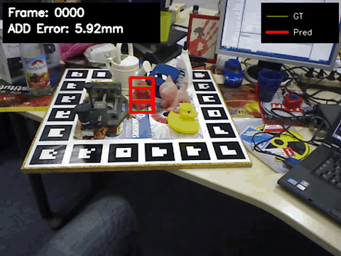

# 6D Pose Estimation with RGB-D Fusion

[](https://colab.research.google.com/github/SFR-Vision/6d-pose-estimation/blob/main/colab_notebook.ipynb)

Deep learning-based 6D object pose estimation on the LineMOD dataset, comparing RGB-only and RGB-D fusion approaches.



## Team Members
 **Ulugbek Rakhmatullaev**,
 **Karim Abdelgelil Mohamed Shalaby**,
 **Mohammad Fakih** 

## Model Architectures

### RGB Model (4-channel input)
- **Input**: RGB (3) + Mask (1) = 4 channels
- **Backbone**: Modified ResNet50 (pretrained on ImageNet)
- **Outputs**: Rotation (quaternion) + Z-depth (learned), X,Y computed geometrically
- **Parameters**: 26.6M

### RGBD Model (5-channel input with z_sensor offset)
- **Input**: RGB (3) + Depth (1) + Mask (1) = 5 channels
- **Architecture**: Dual-stream fusion
  - RGB+Mask stream: ResNet50 → 2048 features
  - Depth+Mask stream: Custom CNN → 512 features
  - Fused features → Rotation head + Z-offset head
- **Z prediction**: `z_final = z_sensor + z_offset` (leverages depth sensor as prior)
- **Parameters**: 29.7M

## Results

| Model | ADD Error (mm) | ACC@2cm (%) | Improvement |
|-------|----------------|-------------|-------------|
| RGB | 31.5mm | 41.2% | Baseline |
| **RGBD** | **13.5mm** | **84.9%** | **57% better ADD, 2x accuracy** |

### Per-Object Results

| Object | RGB ADD | RGBD ADD | RGB ACC | RGBD ACC |
|--------|---------|----------|---------|----------|
| 01-ape | 31.9mm | 8.7mm | 38.2% | 98.4% |
| 02-benchvise | 30.3mm | 16.1mm | 29.8% | 68.6% |
| 04-camera | 29.7mm | 14.4mm | 34.2% | 79.2% |
| 05-can | 28.5mm | 12.9mm | 41.2% | 89.9% |
| 06-cat | 24.0mm | 10.5mm | 48.7% | **100%** |
| 08-driller | 34.8mm | 19.3mm | 31.4% | 68.6% |
| 09-duck | 26.5mm | 10.4mm | 48.8% | 98.4% |
| 10-eggbox* | 31.9mm | 6.6mm | 72.8% | **100%** |
| 11-glue* | 35.4mm | 8.3mm | 73.0% | **100%** |
| 12-holepuncher | 30.2mm | 10.7mm | 36.6% | 94.3% |
| 13-iron | 38.1mm | 21.5mm | 19.1% | 49.6% |
| 14-lamp | 34.8mm | 14.6mm | 32.8% | 86.1% |
| 15-phone | 32.9mm | 21.5mm | 29.5% | 70.5% |

*Symmetric objects use ADD-S metric

## Project Structure

```
Pose6D/
├── data/                           # Dataset classes
│   ├── dataset_rgb.py              # RGB+Mask dataset (4ch)
│   └── dataset_rgbd.py             # RGB+Depth+Mask dataset (5ch)
├── models/                         # Neural network architectures
│   ├── pose_net_rgb.py             # RGB model
│   ├── pose_net_rgbd.py            # RGBD dual-stream model
│   ├── pose_loss.py                # Training loss (AutoWeighted/Geodesic)
│   └── add_loss.py                 # ADD evaluation metric
├── scripts/
│   ├── training/                   # Training scripts
│   │   ├── train_rgb.py            # Train RGB model
│   │   ├── train_rgbd.py           # Train RGBD model
│   │   └── train_yolo_seg.py       # Train YOLO segmentation
│   ├── inference/                  # Inference scripts
│   │   ├── inference_rgb.py        # RGB inference with visualization
│   │   └── inference_rgbd.py       # RGBD inference with visualization
│   ├── visualization/              # Visualization & analysis
│   │   ├── plot_training.py        # Generate training curves
│   │   ├── per_object_metrics.py   # Per-object ADD metrics
│   │   └── compare_all_models.py   # Side-by-side comparison
│   └── setup/                      # Setup utilities
│       ├── setup_data.py           # Download LineMOD dataset
│       └── setup_weights.py        # Download pretrained weights
├── utils/                          # Utility modules
│   ├── camera.py                   # Camera intrinsics
│   ├── mesh_utils.py               # 3D model loading
│   ├── visualization.py            # Drawing functions
│   └── inference_utils.py          # Inference helpers
├── weights_rgb/                    # RGB model weights & history
├── weights_rgbd/                   # RGBD model weights & history
├── datasets/Linemod_preprocessed/  # LineMOD dataset
├── report/                         # CVPR-style LaTeX report
├── colab_notebook.ipynb            # Google Colab demo
```

## Installation

```bash
# Clone repository
git clone https://github.com/SFR-Vision/6d-pose-estimation.git
cd 6d-pose-estimation

# Create conda environment
conda env create -f environment.yml
conda activate pose6d

# OR use pip
pip install -r requirements.txt
```

## Usage

### 1. Setup Dataset & Weights
```bash
python scripts/setup/setup_data.py      # Download LineMOD dataset
python scripts/setup/setup_weights.py   # Download pretrained weights
```

### 2. Train Models
```bash
# Train RGB model (75 epochs, ~3.5 hours)
python scripts/training/train_rgb.py

# Train RGBD model (75 epochs, ~3.5 hours)
python scripts/training/train_rgbd.py

# Train YOLO segmentation (for object detection)
python scripts/training/train_yolo_seg.py
```

### 3. Run Inference
```bash
python scripts/inference/inference_rgb.py    # RGB model
python scripts/inference/inference_rgbd.py   # RGBD model
```

### 4. Visualize Results
```bash
# Generate training curves
python scripts/visualization/plot_training.py --all

# Per-object metrics
python scripts/visualization/per_object_metrics.py
```

## Citation

```bibtex
@misc{pose6d2026,
  title={6D Pose Estimation with RGB and RGB-D Models},
  author={Rakhmatullaev Ulugbek, Shalaby Karim, Fakih Mohammad},
  year={2026},
  howpublished={GitHub Repository},
  url={https://github.com/SFR-Vision/6d-pose-estimation}
}
```

## Acknowledgments

- LineMOD Dataset: Hinterstoisser et al., 2012
- DenseFusion: Wang et al., 2019
- Ultralytics YOLOv8
- PyTorch

## License

MIT License
